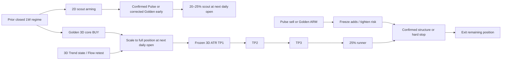

# Golden Oracle × Trend Waves × Pulse: Fusion Investigation

Date: 2026-07-29
Status: research conclusion and implementation blueprint; not a production trading strategy

## Executive conclusion

The systems should be amalgamated, but not by replacing Trend Waves' triangles with Golden
Oracle BUY/SELL markers or by requiring every indicator to agree.

The strongest design is a **position-lifecycle system with separate jobs**:

- **Golden Oracle remains the 3D core-entry engine.**
- **A corrected 2D→3D Golden early setup and confirmed Pulse turns become small scout
  entries**, not substitutes for Golden.
- **Trend becomes regime, veto, retest, and trailing-risk context**, not the primary trigger.
- **A frozen 3D-ATR partial-profit ladder becomes the first Golden TP engine.**
- **Pulse/Golden bearish warnings arm risk reduction; structure and price stops confirm
  executable exits.** A bearish warning alone should not liquidate the position or reverse short.
- **The chart timeframe becomes presentation only.** Decisions use explicit, fixed analysis
  clocks, so switching the visible chart from 1D to 3D cannot rewrite the trading plan.

The initial causal experiment supports this separation of roles:

- Pulse buys were promising and early, but sparse.
- Base Trend flips were not superior Golden replacements.
- Trend's 3D “strong” subset improved modestly; the equivalent 2D subset did not.
- A frozen `1.5 / 2.5 / 3.5 × 3D ATR` TP ladder improved drawdown and Sharpe, but reduced
  total return.
- Adding the present Trend flip or Golden structure warning as an unconditional hard exit made
  the tested policy worse.

This is exciting, but it is not yet evidence for a “legendary” production system. The honest next
step is to build the shared clock and execution engine, preregister a small candidate matrix, and
test it on deeper point-in-time OHLC data.

## What the code actually contains

### Golden Oracle

`signal_layer/confluence.py` is not standard price MACD:

- RSI(14)
- RSI-MACD = `EMA14(RSI) - EMA60(RSI)`
- signal = `EMA5(RSI-MACD)`
- StochRSI(14, 14, 3, 3)
- canonical IPO-phased three-trading-session bars
- prior closed weekly confirmation
- monthly, 2-week, and daily-SMA200 regime gates

The core long entry is a 3D RSI-MACD bullish cross with a recent StochRSI bullish cross and
confirmation/regime constraints.

Golden v2 already has two relevant display systems:

1. An early dot: 3D StochRSI reversal plus rising 2D RSI-MACD histogram.
2. A two-stage sell warning: bearish momentum **arms** the setup, then a daily confirmed swing-low
   break **confirms** it.

Important qualification: the displayed SELL is not the backtested Golden exit. The current scored
exit is still internal `CS & ~strong_bull`. The displayed structure SELL therefore cannot yet be
described as a validated sell system.

The current early-dot implementation also uses calendar `2B/3B` buckets whose labels are not safe
availability timestamps. The research harness rebuilds that setup on canonical closed session bars.

### Trend Waves

The clean-room Trend Waves implementation on `origin/master` is not weekly MACD.

Its base engine is an ATR trailing-stop state machine on the **active chart timeframe**:

```text
period = JS-round(7 + 1.5 × sensitivity)
mult   = 1.2 + 0.28 × sensitivity

bull stop = max(previous stop, hl2 - mult × ATR)
bear stop = min(previous stop, hl2 + mult × ATR)
flip      = close crosses the ratcheting stop
```

At default sensitivity 5, this is ATR(15) with a 2.6 multiplier.

The “strong” tier is only the absolute 10-bar rate of change at or above its trailing 200-bar 70th
percentile. Power Bottom/Top adds recent RSI(14) recovery from 25/75. Other useful filters—Flow
Band, Market Dashboard, and Volt Bands—are separate and mostly disabled by default.

The local dynamic TP ladder is frozen from a Trend flip's close and ATR:

```text
TP1 1.5 ATR
TP2 2.5 ATR
TP3 3.5 ATR
TP4 5.0 ATR
TP5 6.5 ATR
TP6 8.0 ATR
```

The current implementation draws annotations; it is not an order ledger. TP and SL scans are
independent, partial quantities are absent, and same-bar ordering is unresolved. That visual layer
must not be transplanted directly into Golden.

### Pulse Oscillator

The local clean-room Pulse wave is:

```text
diff   = close - previous close
mom    = EMA(EMA(diff, long), short)
wave   = 100 × mom / trailing-200 max(abs(mom))
gapped = EMA(wave, 2 × signal)
```

Profiles are:

| Profile | Short | Long | Signal |
|---|---:|---:|---:|
| Scalper | 7 | 15 | 6 |
| Day | 13 | 25 | 9 |
| Swing | 21 | 40 | 13 |

A buy is a confirmed local wave trough at or below -60. A sell is the mirrored peak at or above
+60.

The historical glyph is drawn on the prior extremum bar, but the event is only knowable on the
following bar. On a canonical 3D chart, the median visual lead in the experiment was about three
to five calendar days. The visual marker must therefore never be used as the strategy timestamp.

The divergence module has an even larger timing issue: a wing-5 pivot is confirmed five bars later
but its event index is stamped on the old pivot. Divergence events are excluded from the proposed
strategy until their `known_at` contract is corrected.

## The timeframe problem comes first

The app currently has several incompatible meanings of “3D”:

- Golden groups trading sessions from the symbol's IPO phase and labels a bar by its open date.
- ChartPanel groups from the first loaded row, labels with the last constituent date, and keeps a
  trailing partial bucket.
- Pro Suites consume the chart's already-resampled bars, so changing the visible timeframe changes
  the signals and targets.
- Golden v2 has auxiliary calendar `2B/3B` resamples.
- The browser Pine runtime uses another calendar grouping and does not implement TradingView's
  `strategy.*` broker emulator.

The mismatch is material. In a read-only current-app comparison, AAPL's canonical and ChartPanel
Trend s5 clocks each produced 21 flips, but every dated event differed; NVDA happened to align.

The production rule should be:

| Job | Fixed clock | Availability rule |
|---|---|---|
| Core entry and episode | 3 trading sessions | only after the scheduled 3D bar closes |
| Early scout | 2 trading sessions plus 3D state | only closed 2D/3D inputs |
| Macro regime | 1 calendar week | prior fully closed week |
| Fill, TP, SL, structure | daily OHLC | decision close → next session open |
| Visible chart | any | presentation only; cannot change decisions |

Every feature and event needs `bar_start`, `bar_end`, and `known_at`. The latest incomplete 3D bar
may be shown as developing context, but it cannot emit a production decision.

## Causal experiment

The new research harness is `research/master_indicator_fusion_lab.py`.

It:

- ports the shipped clean-room core Trend flip/strong-tier and Pulse wave buy/sell formulas;
- uses the Pulse confirmation bar, not its backdated glyph;
- constructs completed IPO-phased 2D/3D bars;
- rebuilds the Golden early dot on a causal 2D→3D clock;
- fills signals at the next real daily open;
- freezes 3D ATR at entry;
- supports partial TP1/TP2/TP3 fills and a 25% runner;
- uses explicit commissions, slippage, gaps, and conservative stop-first ordering when the daily
  candle cannot reveal the intraday path;
- separates bullish and bearish events;
- prevents forward outcomes from crossing the train/holdout boundary;
- rejects ticker/history mismatches;
- separates real OHLC from synthetic prior-close-open proxies.

The local overlap contained 228 symbols:

- 221 passed alignment checks;
- only 25 had usable `real_ohlc`;
- 196 used `synthetic_open_deepstore`;
- seven were rejected;
- META was correctly rejected because its terminal history included a different ~$15 security
  before a 90-session gap while Golden's series represented Meta Platforms.

The synthetic cohort is useful as a secondary signal-shape check, but it is excluded from TP/SL
execution results because its next open assumes no overnight gap.

### Entry evidence

The table below uses the real-OHLC cohort, a common eligibility window, and the 2024+ diagnostic
holdout. Returns are direction-correct 21-session results from the next session open after costs.
This holdout has now been inspected and is not an untouched final test.

| Bullish event | N | Win rate | Mean 21-session return | Median | Interpretation |
|---|---:|---:|---:|---:|---|
| Golden core BUY | 98 | 58.2% | +4.57% | +1.49% | Good core baseline |
| Corrected Golden 2D→3D early | 248 | 59.7% | +4.64% | +1.91% | Broadest scout candidate |
| Pulse 2D Day BUY | 43 | 67.4% | +5.75% | +4.86% | Promising earlier scout |
| Pulse 3D Day BUY | 24 | 79.2% | +7.49% | +7.11% | Very promising, but tiny sample |
| Pulse 3D Swing BUY | 8 | 75.0% | +3.89% | +3.60% | Too little evidence |
| Trend 2D s5 BUY | 111 | 54.1% | +4.69% | +0.27% | Outlier-driven; weak median |
| Trend 3D s5 BUY | 76 | 57.9% | +4.31% | +0.93% | Similar to Golden, not superior |
| Trend 3D s5 strong BUY | 32 | 62.5% | +4.94% | +1.40% | Modest filter improvement |

The broader synthetic proxy cohort agreed directionally on Pulse 3D Day BUY—205 outcomes, 63.9%
wins, +3.61% mean—but those are not executable next-open results.

These rows are overlapping observations and market-regime clustered. They do not have block-
bootstrap confidence intervals yet. In particular, the 24-event Pulse result is a hypothesis
generator, not a production promotion decision.

### Does Pulse really lead Golden?

One-to-one scout matching was restricted to each family's usable history. Same-day events were not
counted as leads, bearish scout events invalidated an unmatched bullish setup, and an early event
could match only one later Golden buy.

This timing-only table uses all 221 aligned symbols, including the synthetic-open proxy cohort;
it does not simulate fills or TP/SL execution.

| Scout family | Golden coverage | Median lead | Scout→Golden conversion |
|---|---:|---:|---:|
| Corrected Golden 2D→3D early | 60.7% | 13 days | 27.7% |
| Pulse 2D Day | 8.0% | 11.5 days | 25.7% |
| Pulse 3D Day | 3.1% | 5 days | 13.9% |
| Trend 2D s5 | 16.2% | 5 days | 15.8% |
| Trend 3D s5 | 3.1% | 12 days | 4.6% |

The 25-real-OHLC subset was directionally similar: Golden early covered 58.6% of Golden buys,
Pulse 2D covered 7.4%, and Pulse 3D covered 3.4%.

Pulse therefore does lead some Golden buys, but it is not a general early version of Golden. It is
a sparse, partly orthogonal reversal event. That is exactly why it belongs in a scout lane.

### False-positive claim

The default Trend flip did not demonstrate superior entry filtering. The 3D “strong” subset
improved from 57.9% to 62.5% wins at 21 sessions, but only had 32 outcomes. The 2D “strong” subset
was worse than its base stream: 44.2% wins and a negative median return.

The apparent cleanliness of Trend Waves is substantially explained by ATR hysteresis and signal
lag. The more interesting filtering components—Flow Band retest quality and Market Dashboard
regime/pressure—must be tested separately; they are not evidence already contained in the base
triangles.

### TP policy evidence

The policy table uses only real daily OHLC, next-open fills, 3 bps commission plus 1 bp slippage per
side, and independently flat-reset 2024+ windows. Trades are totals; every other numeric column is
the median of per-symbol results across 24 symbols with holdout trades. “Expectancy/trade” is
therefore the median per-symbol trade expectancy, not the expectancy of one pooled 75-trade ledger.

| Policy | Trades | Win rate | Expectancy/trade | Total return | Max DD | Sharpe |
|---|---:|---:|---:|---:|---:|---:|
| Golden internal exit | 75 | 66.7% | +16.52% | +33.13% | -33.80% | 0.587 |
| + frozen TP1/2/3, 25% each + runner | 75 | 66.7% | +9.88% | +28.07% | -21.01% | 0.691 |
| + 1.5 ATR stop and TP ratchet | 113 | 60.0% | +4.44% | +15.12% | -17.68% | 0.511 |
| + Trend s5 hard exit | 115 | 60.0% | +2.80% | +11.00% | -17.83% | 0.454 |
| + current structure hard exit | 120 | 60.0% | +2.56% | +10.31% | -16.43% | 0.498 |

For the TP-only ladder, median per-symbol episode hit rates were:

- TP1: 77.5%
- TP2: 66.7%
- TP3: 45.0%

The result is encouraging but nuanced:

- The TP ladder materially reduced drawdown and improved Sharpe.
- It also clipped large winners, lowering expectancy and total return.
- The 1.5 ATR initial stop plus immediate break-even ratchet was too aggressive.
- Neither Trend flips nor the current structure SELL earned promotion as unconditional exits.

Replacing Golden's internal exit with the structure SELL was worse still (+9.24% median total
return); the main table reports the more relevant additive test.

The next TP experiment should keep the frozen ladder but test a wider disaster/structure stop and
slower ratchet. Candidate initial stops should be preregistered, for example:

1. latest **confirmed** daily swing low minus 0.25 ATR;
2. `2.5 × 3D ATR`;
3. the looser of those two, capped by a portfolio risk budget.

After TP1, test “reduce risk” against immediate break-even. After TP2, a ratchet to TP1 is more
defensible. Do not continuously move TP levels with a recalculating ATR in the baseline; that makes
the historical target path difficult to interpret and invites hindsight.

## Proposed Master Oracle lifecycle



### Entry rules to test

Use lanes, not one giant `AND`:

1. **Scout**
   - corrected Golden early OR confirmed Pulse buy;
   - prior closed weekly regime not bearish;
   - Golden bear-block false;
   - 20–25% position;
   - one scout allocation maximum per active setup.

2. **Core**
   - Golden 3D BUY at the confirmed 3D close;
   - fill at next daily open;
   - scale to full risk;
   - Trend 3D bullish/strong is a score or veto candidate, not a hard prerequisite in the first
     test.

3. **Add-on**
   - high-quality Flow Band retest while Golden state is valid;
   - only if the portfolio risk budget and frozen episode stop permit.

### Exit hierarchy to test

1. **Pulse bearish turn:** soft warning; no automatic liquidation.
2. **Golden ARM:** stop new adds, optionally reduce 10–25%.
3. **TP1/TP2/TP3:** deterministic partial fills.
4. **Hard exit candidate:** two independent keys, such as:
   - a confirmed daily swing-low break; and
   - 3D Trend stop breach or prior closed weekly bearish regime.
5. **Emergency stop:** price/structure stop independent of indicator state.

A long exit is not automatically a short entry. Shorting needs its own entry, borrow, gap, and
regime research.

## Backtester architecture

BigBeluga's most reusable idea is not its private formulas. It is the rule architecture:

- persistent bias filters versus one-shot triggers;
- AND confluence and OR trigger groups;
- ordered sequences with invalidation;
- explicit long/short separation;
- signal exits;
- up to three ATR/percent profit levels with exit quantities;
- fixed/trailing stops.

Their [entry-condition documentation](https://docs.bigbeluga.com/backtesters/bigbeluga-backtester/entry-conditions)
describes the modular condition catalog. Their
[TP/SL documentation](https://docs.bigbeluga.com/backtesters/bigbeluga-backtester/take-profit-and-stop-loss)
explicitly supports three targets and custom exit sizes. Their SMC tester demonstrates
[sequential conditions and invalidation](https://docs.bigbeluga.com/backtesters/backtesting-system-smc/entry-conditions).

TradingView supplies the missing broker layer for them. Its strategy engine normally creates an
order at bar close and fills it no earlier than the next tick/open, and it natively models partial
exits, brackets, commissions, slippage, margin, and a trade ledger
([TradingView strategy documentation](https://www.tradingview.com/pine-script-docs/concepts/strategies/)).
Our Pine runtime currently no-ops `strategy.*`, so our app must implement these capabilities.

### Proposed local components

1. `signal_layer/timeframes.py`
   - canonical 1D/2D/3D/1W bars;
   - `bar_start`, `bar_end`, `known_at`, completeness;
   - prefix-invariance tests.

2. Strategy signal bus
   - immutable events with symbol, family, direction, source timeframe, marker time, `known_at`,
     version, and parameters;
   - no consumer may trade a glyph timestamp.

3. Rule/state-machine layer
   - persistent filters;
   - one-shot triggers;
   - ordered sequences;
   - invalidation and cooldown;
   - separate entry, arm, confirm, and exit roles.

4. Daily execution ledger
   - next-open market fills;
   - stop/limit gaps;
   - partial position accounting;
   - OCO behavior;
   - commissions/slippage;
   - conservative same-bar policy or optional intraday path;
   - daily equity and exposure.

5. Result contract
   - gross/net return, CAGR, Sharpe, max drawdown;
   - profit factor and expectancy;
   - turnover, exposure, costs;
   - MAE/MFE and time-to-target;
   - TP hit rates and exit reasons;
   - data quality, source hash, code hash, parameters, and clocks.

6. Product integration
   - phase 1: batch JSON into the existing Strategy Tester;
   - phase 2: an interactive rule builder;
   - phase 3: alerts driven from the same strategy state, never independently recomputed daily
     defaults.

The same position/TP lifecycle can later serve Prophet because Prophet already has target and
invalidation concepts; it lacks an execution-tested ledger.

## Validation program

Do not auto-optimize the winning row on the same 2,000 bars. BigBeluga documents a last-2,000-bar
auto-optimization mode in its
[Trend Signals page](https://docs.bigbeluga.com/beluga-market-waves/beluga-market-waves/trend-signals);
that is an in-sample convenience, not evidence of out-of-sample robustness.

Preregister a small matrix:

| ID | Entry | Risk/exit |
|---|---|---|
| A | Golden core | current internal exit |
| B | Golden + corrected early scout | current internal exit |
| C | Golden + Pulse scout | current internal exit |
| D | Golden + Trend regime/retest score | current internal exit |
| E | best entry lane | frozen TP ladder + wider structural stop |
| F | best entry lane | E + two-key armed/confirmed sell |

Required next data:

- longer real adjusted OHLC, including true opens;
- corporate-action-safe prices;
- delisted stocks and point-in-time universe membership;
- sector/industry history;
- optional intraday data for ambiguous TP/SL candles.

Required evaluation:

- walk-forward parameter selection;
- untouched final period;
- bull, bear, crash, and range regimes;
- block-bootstrap uncertainty by symbol and time;
- matched unconditional controls;
- no single symbol/sector dominating;
- latency and turnover penalties.

An initial promotion bar could require:

- at least 500 independent-ish completed episodes across the development panel;
- lower median max drawdown by at least 20%;
- retain at least 90% of baseline median CAGR;
- stable direction across the majority of symbols and all major regimes;
- no material failure after realistic costs and gap handling.

## External-formula and licensing boundary

BigBeluga describes Trend Signals as low-pass/noise-reduced trend logic and Nautilus as a smoothed
signal-processing oscillator, but it does not publish the exact premium formulas
([Trend Signals](https://docs.bigbeluga.com/beluga-market-waves/beluga-market-waves/trend-signals),
[Nautilus](https://docs.bigbeluga.com/oscillators/nautilus-tm),
[Nautilus signals](https://docs.bigbeluga.com/oscillators/nautilus-tm/signals)).

The Pro Suites are clean-room, standard-math analogues. They should use original names, visual
language, parameters, and documentation. Public descriptions support capability recreation, not
claims of formula parity. Any prior wording that says the premium formulas were fully copied or
reverse-engineered should be treated as inaccurate.

## Immediate implementation order

1. Merge or port the Pro Suites branch only after preserving the current dirty workspace.
2. Build the canonical timeframe/availability contract and remove incomplete-bar decisions.
3. Fix Pulse/RSI divergence event timestamps and the current Golden early-dot clock.
4. Refactor Golden's simulator into the shared daily execution ledger.
5. Implement the frozen TP episode on Golden with explicit partial quantities.
6. Add scout lanes behind an experimental flag.
7. Add Trend/Flow features as scores, then test them separately.
8. Build the two-key sell state machine.
9. Expand real-OHLC data and run the preregistered walk-forward program.
10. Only then surface a single “Master Oracle” indicator and reuse its risk engine in Prophet.

## Verification performed

- `python3 -m py_compile research/master_indicator_fusion_lab.py`
- `pytest -q tests/test_master_indicator_fusion_lab.py` → 11 passed
- full overlapping-universe causal run
- real-OHLC-only rerun for entry, TP, SL, Trend strong-tier, and holdout summaries

An existing repository acceptance check remains red: `tests/test_golden_gate.py` currently has two
contract-parity failures (for example NVDA reports 59 engine events versus 53 exported events and
zero shared dates). This research did not modify Golden production code or its exported contract.
That stale/divergent contract must be reconciled before a fused engine is promoted.
