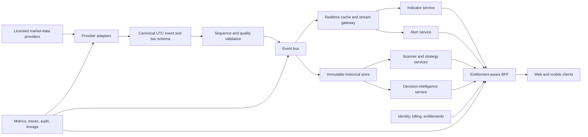

# Mastermind Terminal: Production and Competitive Readiness Assessment

**Date:** 2026-07-18

**Canonical assessment:** this file

**Code baseline:** `origin/master@0ea34b7e` (2026-07-16)

**Decision:** strong private/invitation beta; not yet ready for broad paid production use or honest face-to-face positioning against TradingView and TrendSpider.

> This assessment uses the current remote `origin/master`, not the older checked-out feature branch. Repository line references in this document refer to that commit. The UI was also run locally at desktop and 390 px mobile widths. Local fixtures were sufficient for workflow and visual inspection, but they do not prove production feed freshness, exchange entitlements, or external-service availability.

## Executive verdict

Mastermind already has the beginnings of a serious terminal: a credible charting shell, multi-chart layouts, proprietary Golden Oracle signals, fundamentals, options/flow research, a Pine-like interpreter, drawings, screeners, alerts, AI tools, international coverage, and an unusually deep body of decision context.

The central problem is not that the product needs another dozen panels. The product looks more production-grade than its underlying guarantees actually are.

Today the system has four different maturity levels living inside the same polished shell:

1. **Useful and genuinely wired:** daily charts, chart interaction, layouts, watchlists, user scripts, fundamentals, authenticated AI tool calls, and parts of options/flow.
2. **Usable beta:** mobile charting, drawings, multi-chart, indicators, international intraday data, Pine execution, and workspace persistence.
3. **Narrow prototypes presented as products:** the fixed Golden Oracle screener, one-shot alerts without delivery, Conviction Book standing in for a portfolio, and simple automated drawing heuristics.
4. **Research or display tier:** parts of Prophet, GEX, Neural Web, heatmap interpretation, and forward-performance ledgers that explicitly remain under validation.

A broad paid launch would turn those maturity mismatches into trust failures. A professional trader will forgive a smaller indicator catalog. They will not forgive a stale quote that looks live, an alert that fires only in a database, a cross-market chart aligned to the wrong instant, a backtest surface that is missing, or an entitlement leak through a warm cache.

The correct strategy is therefore:

- **Match the professional table stakes** for the core loop: trustworthy data, fast charting, persistent workspaces, flexible scanning, delivered alerts, strategy testing, mobile continuity, and operational reliability.
- **Do not attempt literal horizontal parity** with TradingView's community, broker network, drawing count, and global distribution in the first campaign.
- **Beat both competitors at one coherent job:** convert chart, macro regime, proprietary signals, options positioning, fundamentals, and contradictory evidence into an explainable, timestamped decision packet with an invalidation plan and measured historical calibration.

If Mastermind executes that sequence, it can stand face-to-face with TradingView and TrendSpider for serious research-driven swing and position traders. It will not initially replace TradingView for every charting/social/broker use case or TrendSpider for every automation-first use case, and the product should not pretend otherwise.

## What “face-to-face” should mean

TradingView and TrendSpider are not the same opponent.

- **TradingView is the horizontal network and charting operating system.** Its official product material advertises 20+ chart types, 110+ smart drawing tools, 400+ built-in indicators and strategies, 100,000+ community scripts, Pine development and strategy testing, broad screeners, server-side alerts, cross-device use, a social layer, and 100+ broker integrations. See [TradingView features](https://www.tradingview.com/features/), [Supercharts guide](https://www.tradingview.com/support/solutions/43000746464-getting-started-with-supercharts/), and [broker integration](https://www.tradingview.com/brokerage-integration/).
- **TrendSpider is the automation and guided-analysis opponent.** Its official material emphasizes 200+ indicators, automated pattern and trendline recognition, multi-timeframe analysis, no-code strategy testing, AI strategy creation, multi-factor alerts, bots, scanning, and Sidekick. See [TrendSpider](https://trendspider.com/), [automated trendlines](https://help.trendspider.com/kb/automated-technical-analysis/automated-trendline-detection), [market scanner](https://help.trendspider.com/kb/scanner/market-scanner), and [strategy tester](https://help.trendspider.com/kb/strategy-tester/understanding-strategy-tester-from-trendspider).

For Mastermind, “face-to-face” should mean all of the following:

1. A new professional user can complete the entire **discover → analyze → test → alert → monitor → review** loop without leaving the product.
2. Every price, signal, model result, and alert has a clear source, basis, timestamp, freshness state, and entitlement.
3. The product remains usable across desktop, tablet, and mobile, with cloud-synced state.
4. The platform survives real multi-user load, provider failure, bad data, migrations, and deployments without silently degrading truth.
5. Mastermind wins a blinded workflow comparison for its target trader because it reaches a better decision faster—not because it has more toolbar icons.

This definition deliberately does **not** require immediate parity in public social publishing, a marketplace of tens of thousands of scripts, 100+ brokers, every exotic chart type, or every drawing primitive.

## Target customer and competitive wedge

The first production customer should be explicit:

> A serious self-directed swing or position trader who follows U.S. and selected international equities/ETFs, uses technical structure but wants macro regime, fundamentals, options positioning, catalyst context, and signal validation in one workflow.

This is a better initial wedge than “all traders” or latency-sensitive intraday execution. The present system is already strongest at synthesized research and decision context. It is weakest at tick-perfect execution infrastructure, global exchange breadth, community scale, and broker routing.

The core promise should become:

> **Mastermind does not just show a setup. It shows why the setup exists, what disagrees, what invalidates it, how fresh the evidence is, and how similar setups actually performed.**

That is differentiated. “Another TradingView with fewer indicators” is not.

## Current readiness scorecard

Scale: `0` absent, `1` prototype/display-only, `2` partial beta, `3` credible usable beta, `4` production-quality, `5` category-leading. These are directional product judgments, not laboratory measurements. **They must not be averaged:** one unresolved launch blocker is sufficient to stop general availability.

| Capability | Current | Production target | Gate | Assessment |
|---|---:|---:|---|---|
| Core desktop charting | 3.2 | 4.2 | Major gap | Credible shell and interaction model; lacks competitor depth, complete keyboard access, performance budgets, and several trustworthy controls. |
| Market-data truth and freshness | 1.8 | 4.5 | **Launch blocker** | Mixed live/delayed/synthesized sources, timestamp normalization defects, polling, and weak publication guarantees are the biggest product risk. |
| Layouts and multi-chart | 2.8 | 4.0 | Major gap | 1/2/4 panes and saved layouts exist; workspace state is split between cloud and device, and mobile hides inactive panes while leaving work mounted. |
| Indicators | 2.7 | 3.8 | Major gap | Roughly 25 registered studies and proprietary signals are a useful base, but several implemented advanced studies are absent from the picker. |
| Drawings and automated TA | 2.2 | 3.8 | Major gap | Nine primitives and simple auto trend/Fibonacci/S/R heuristics; no production-quality lock/group/template/object-alert workflow. |
| Custom scripting | 2.2 | 3.8 | Major gap | Real Pine-like interpreter for indicators, but incomplete language coverage, main-thread execution, no conformance program, and no strategy orders. |
| Strategy testing | 0.5 | 4.0 | **Parity blocker** | Current master removed the user-facing tester; proprietary precomputed statistics are not a user strategy lab. |
| Screener/scanner | 1.7 | 4.0 | **Parity blocker** | A narrow client-side Golden Oracle filter, not a general technical/fundamental/flow/formula scanner. |
| Alerts and automation | 1.3 | 4.2 | **Launch blocker** | CRUD and five-minute evaluation exist; outbound delivery, retries, logs, complex conditions, and true real-time evaluation do not. |
| Fundamentals and analyst context | 3.0 | 4.0 | Competitive beta | A real strength, but needs consistent freshness, deep linking, provenance, and a cleaner information hierarchy. |
| Options/flow intelligence | 2.7 | 4.0 | Differentiated beta | Rich differentiated surfaces; some are research/display tier and need stronger contracts, validation, and consolidation. |
| Portfolio and review loop | 1.1 | 3.8 | Major gap | “Conviction Book” is a ranked watchlist, not portfolio accounting, attribution, or trade review. |
| AI/copilot | 2.7 | 4.3 | Differentiated beta | Real tool-calling backend; stale capability claims, weak provenance/evaluation, and missing cost/timeout controls prevent professional trust. |
| Mobile/tablet continuity | 2.2 | 4.0 | Major gap | The chart renders on mobile, but key capabilities disappear, the toolbar requires horizontal scrolling, and the layout is a reduced desktop rather than a touch-native workflow. |
| Accessibility | 1.2 | 4.0 | **Launch blocker** | Core mouse-only controls, inaccessible dialogs/search, weak chart data alternative, contrast issues, and disabled zoom are release blockers. |
| Collaboration and sharing | 0.8 | 3.2 | Later | No mature shared layouts, chart links/comments, permissions, or team workspace. |
| Broker/paper execution | 0.2 | 3.0 later | Deferred | No coherent execution workflow. Correctly deferred until data, alerts, and risk controls are trustworthy. |
| Security, privacy, commercial controls | 1.6 | 4.3 | **Launch blocker** | RLS and security headers are a good base; auth defaults, cache ordering, public proprietary data, fingerprinting, and missing billing/entitlements block launch. |
| Reliability, observability, CI/CD | 1.7 | 4.3 | **Launch blocker** | Unit/type coverage and atomic app rollback exist, but lint is red, production build is not gated, data publication is non-atomic, and central telemetry is absent. |

The product is therefore **feature-rich but production-light**. The weakest scores sit in the exact places where paid professionals judge trust.

## Current strengths worth preserving

The assessment should not trigger a rewrite. Several foundations are valuable:

- The latest desktop terminal presents a coherent institutional visual language, with a capable chart, watchlist, right research rail, multi-chart, symbol search, intervals, chart types, drawings, indicators, layouts, and multi-timeframe tools.
- Golden Oracle, fundamentals, macro/Neural Web context, options/flow, GEX, heatmaps, and AI create a richer raw decision set than a generic charting clone.
- Supabase owner-scoped row-level security is already present for watchlists, layouts, scripts, alerts, and drawings (`supabase/migrations/0001_init.sql:28-133`; `0002_drawings.sql:9-26`).
- The AI copilot is not a visual mock: it is an authenticated DeepSeek tool-calling stream (`terminal/app/api/copilot/route.ts:26-53,79-130`; `terminal/lib/copilotTools.ts:649-746`).
- Pine-like execution is real for indicators and includes inputs, many technical functions, plots, shapes, horizontal levels, and higher-timeframe requests (`terminal/lib/pine-engine/README.md:42-77`).
- The current unit/type baseline is meaningful: 263 Vitest tests passed with four marked TODOs, and TypeScript passed during this audit.
- The app deploy path includes atomic `.next` swapping and rollback mechanics, even though the complete deploy/data contract still needs consolidation.
- The latest mobile view is materially improved over earlier snapshots: the main chart renders and the research rail remains reachable below it.

These are assets to harden and simplify, not discard.

## The competitor bar

| Job | TradingView bar | TrendSpider bar | Mastermind now | Required Mastermind answer |
|---|---|---|---|---|
| Chart and annotate | Very broad chart/drawing/indicator ecosystem | Strong charting plus automated TA | Credible core, narrow catalog and incomplete interaction quality | Match the common 80% perfectly; add deeper objects only from measured demand. |
| Find setups | Multi-asset screeners, templates, technical/fundamental fields, saved/exported results, Pine Screener | Multi-factor, multi-timeframe scanner with 70+ built-ins and scheduled/shared scans | Fixed client-side Oracle filter | Server-side formula scanner combining technicals, fundamentals, flow, proprietary signals, and freshness. |
| Test an idea | Pine strategy testing and deep testing | No-code tester, long history, parameter/variance exploration, AI strategies | User tester removed; Pine strategy calls no-op | Restore a deterministic Strategy Lab with code and no-code paths, realistic fills, robustness tests, and reproducibility. |
| Automate monitoring | Server alerts across prices, indicators, strategies, drawings; app/email/webhook/sound | Multi-factor cross-timeframe alerts, SMS/email/webhook/bots | Five-minute evaluator marks DB rows triggered | Build an at-least-once delivery platform with idempotency, retries, audit, real-time conditions, and delivery channels. |
| Work anywhere | Browser, desktop, tablet, mobile with synchronized layouts | Web and mobile workflow | Mobile is feature-reduced; state is partly local | Cloud workspace, touch-native modes, offline/cache behavior, active-pane control, and notification continuity. |
| Customize | Pine ecosystem, versioning, sharing, large public library | JavaScript custom indicators and AI/no-code construction | Partial Pine-like language and script editor | Isolated worker runtime, conformance corpus, debugger/data window, versions, import/export, private sharing first. |
| Execute | Large broker network and chart trading | Broker/crypto routing through integrations | None | Paper trading, then read-only broker sync, then permissioned routing only after platform trust is proven. |
| Explain a decision | Rich tools but mostly user-assembled context | Strong automation/AI assistance | Many proprietary evidence streams but fragmented | A single explainable Decision Packet becomes the moat. |

Official references for the comparison appear in the final section.

## Product truth audit: what is real, partial, or missing

### Data and market coverage

- Daily chart/history is wired through static data and nightly pipelines (`ops/terminal-data:46-101`; `terminal/lib/dataCache.ts:256-273`).
- U.S. quotes are served by Quote Hub, but the default plan is 15-minute delayed unless a correctly licensed production entitlement is enabled (`hub/README.md:25-35`; `terminal/lib/intradaySources.ts:169-181`).
- Crypto uses live Coinbase with OKX failover (`hub/hub.js:85-109,224-228`).
- China A-share snapshots use Tencent and are labelled live (`terminal/lib/intradaySources.ts:169-220`).
- Hong Kong is typically delayed, and the current intraday fallback synthesizes minute OHLC from snapshots (`terminal/lib/intradaySources.ts:98-150,218-220`).
- Canada has no intraday leg (`terminal/lib/intradaySources.ts:153-166`).
- Intraday values are rewritten into market-local display epochs instead of preserving the true UTC instant (`terminal/lib/intradaySources.ts:7-11`). This is unacceptable for cross-market correlation, DST, events, alerts, and future order simulation.
- A dormant direct browser WebSocket path references `NEXT_PUBLIC_POLYGON_KEY` (`terminal/lib/live.ts:4-29`). It must never become the production path because it exposes provider credentials.

### Charting, indicators, drawings, and replay

- Five price chart modes are wired: candles, Heikin-Ashi, bars, line, and area (`terminal/components/TerminalShell.tsx:134`).
- The registry contains roughly 25 indicator families, including advanced studies such as Ichimoku, SuperTrend, anchored VWAP, volume profile, RSI stack, and accumulation (`terminal/lib/indicators.ts:12-16,40-50`). Several are missing from the visible indicator picker (`terminal/components/IndicatorsModal.tsx:7-24`). Discoverability is currently a bigger problem than raw count.
- Drawings cover trendline, ray, horizontal/vertical lines, rectangle, Fibonacci, text, measure, and arrow (`terminal/lib/drawings.ts:4-18`). Automated trend/Fibonacci/S/R tools are fixed-pivot heuristics (`terminal/lib/drawings.ts:26-133`), not a tested recognition engine.
- Bar Replay is effectively dead in current master: replay UI exists behind `replayOn`, but there is no reachable action that turns it on. The state setter only turns it off in the current shell. This is a product-truth bug, not a backlog feature.
- Lock drawings is presented as a disabled future affordance (`terminal/components/DrawingSidebar.tsx:206-218`). Inert controls should not ship as if they were available.

### Screener, alerts, strategy testing, scripts, and portfolio

- Screener loads a manifest into the browser and filters a small fixed schema (`terminal/components/ScreenerView.tsx:13-18,51-56,86-177`). It is not a general scanner.
- Alerts have user-scoped CRUD and a server-side five-minute evaluator for a small condition set, but the engine only marks alerts triggered/disarmed. There is no email, push, SMS, webhook, retry queue, dead-letter path, or delivery log (`ingest/alerts_engine.py:1-20,203-245`).
- Strategy Tester was removed from current master in commit `51134538`. The AI system prompt still says one exists (`terminal/app/api/copilot/route.ts:13`), creating a direct hallucination contract.
- The Pine runtime parses strategy declarations but does not execute strategy orders. Tables, labels, lines, boxes, fills, background colors, and alert conditions are also no-ops; lower-timeframe security calls are approximated (`terminal/lib/pine-engine/README.md:71-108`).
- Pine execution occurs synchronously on the main UI thread and can consume seconds before returning (`terminal/components/ChartPanel.tsx:159,498`; `terminal/lib/pine-engine/runtime.ts:27`).
- “Portfolio” is a watchlist-derived conviction tilt (`terminal/components/PortfolioView.tsx:22-104`), with no holdings, transactions, cash, lots, cost basis, P&L, dividends, FX, attribution, or risk.

### Security, entitlement, privacy, and operations

- Authentication defaults off (`terminal/lib/supabase/middleware.ts:7-18`).
- Warm quote and intraday cache entries can be returned before authentication (`terminal/app/api/quote/route.ts:67-103`; `terminal/app/api/intraday/route.ts:30-40`). Authorization must precede cache lookup.
- Flow and Neural Web endpoints lack a consistent user entitlement check, `/data/*` remains public, and a public R2 bucket uses predictable proprietary-data keys (`SECURITY.md:53-65`).
- Commercial entitlement is effectively a manually controlled `is_pro` Boolean. Billing lifecycle, plan ledger, quotas, teams, and usage controls are not present.
- Rate limiting is in-memory and process-local, while CDN-origin bypass remains possible (`terminal/lib/rateLimit.ts:1-7,51-78`; `SECURITY.md:37-45`).
- The current visitor tracker combines raw IP, user agent, a two-year cross-subdomain ID, and canvas/WebGL device fingerprinting (`terminal/lib/fingerprint.ts:1-71`; `visitor.ts:1-44`; `collect/route.ts:53-100`). No explicit retention/deletion program is encoded in the analytics migration (`supabase/migrations/0004_analytics.sql:1-47`).
- Root viewport configuration disables user scaling (`terminal/app/layout.tsx:12-18`).
- There is no visible centralized crash reporting, APM, tracing, or product SLO system. React boundaries log to the console (`terminal/app/error.tsx:16-18`; `global-error.tsx:14-16`).
- Quote Hub `/health` returns HTTP 200 even when the body reports failure, and uncaught exceptions are logged without terminating the process (`hub/hub.js:119-142,258-264`).
- Current CI runs only type generation, TypeScript, and the default Vitest glob on pull requests (`.github/workflows/ci.yml:1-25`; `terminal/vitest.config.ts:5-10`). It does not gate lint, the production build, E2E, accessibility, visuals, Hub/Python suites, security, or load.
- During this audit, `npm run lint` reported 712 problems, including 585 errors. The production webpack build succeeded only after network access was available for Google Fonts, while CI does not run the build at all.
- The nightly data job writes many symbol artifacts directly into the live directory, continues after stage failures, and stages only the manifest (`ops/terminal-data:13-15,38-40,46-130`). Users can observe mixed dataset generations.

## UI and information-architecture changes

### 1. Reduce the product to five primary workspaces

The present navigation exposes a growing collection of named surfaces—Terminal, Screener, Portfolio, Alerts, Scripts, Heatmap, and a Flow area containing Prophet, Flow Desk, Tape, Tide, Tickers, Screener, GEX, PRISM, Leaders, and Leader Radar. This displays organizational history rather than a user journey.

Replace the primary navigation with:

1. **Chart** — chart, watchlist, compare, drawings, indicators, replay, chart-level AI.
2. **Discover** — scanner, heatmaps, leaders, catalysts, saved searches.
3. **Research** — fundamentals, analyst view, Neural Web/macro, options/flow, Decision Packet.
4. **Automate** — alerts, scripts, strategy lab, jobs/bots, delivery history.
5. **Portfolio** — holdings, risk, attribution, journal, review.

Flow, GEX, PRISM, Prophet, and related modules should become contextual subviews within Research rather than ten co-equal product destinations. A user should navigate by job, not by internal model name.

### 2. Make the chart the stable center and use contextual rails

Desktop target:

```text
┌ Primary nav ┬ Watchlist / object tree ┬──────── Chart workspace ────────┬ Context rail ┐
│ Chart       │ lists, alerts, layers   │ compact command toolbar         │ Decision     │
│ Discover    │                         │ chart panes                      │ Data         │
│ Research    │                         │                                  │ Fundamentals │
│ Automate    │                         │ bottom dock: Pine/Test/Alerts    │ Options      │
│ Portfolio   │                         │                                  │ AI           │
└─────────────┴─────────────────────────┴──────────────────────────────────┴──────────────┘
```

The right rail should be one contextual system with consistent tabs, width, loading, freshness, and provenance. It should not be a sequence of visually unrelated micro-products.

### 3. Compress the toolbar using progressive disclosure

Keep first-order controls visible: symbol, interval, chart type, indicators, drawing, compare, alerts, replay, layout, save. Move advanced automation and analysis into:

- a searchable command palette;
- contextual object menus;
- one **Analyze** menu;
- a stable bottom dock for Pine, Strategy Lab, Alerts, Data Window, and logs.

Do not solve discoverability by adding more top-level buttons. The current mobile toolbar already clips horizontally.

### 4. Establish a truth language across every surface

Every data-bearing panel needs a compact, machine-derived status line:

`LIVE · NASDAQ SIP · UTC 18:43:12.442 · RAW · 186 ms · COMPLETE`

or

`DELAYED 15m · Cboe/IEX basis · as of 18:28 UTC · ADJUSTED · PARTIAL`

The vocabulary must be consistent:

- live, delayed, end-of-day, synthesized, estimated, stale, unavailable;
- source/provider and exchange basis;
- timestamp and timezone;
- raw/adjusted and corporate-action version;
- model/data version;
- coverage/completeness;
- research/display-only/validated status.

This turns honesty into a visible product advantage.

### 5. Remove false and inert affordances

Before adding new controls, audit every visible control with an automated interaction inventory. Bar Replay, drawing lock, “coming soon” trading settings, stale AI capability claims, disabled time ranges, and any event with no listener should either work, explain its unavailable state precisely, or disappear. Current examples include a plus button that dispatches `mm:plus-btn` without a listener and drawing shortcuts advertised in the dock even though they are not wired; `Alt+R` currently resets the chart rather than selecting Rectangle (`terminal/components/ChartFrameBar.tsx:374`; `DrawingSidebar.tsx:19`; `ChartPanel.tsx:2931`).

Access states need the same honesty. The default public/guest shell exposes Save Layout, Alerts, and AI actions whose APIs require authentication; failures can be silent or appear only after the user has done work. Choose either a deliberate guest demo with local persistence and clear “sign in to sync” conversion, or an authenticated SaaS workspace. Never present a cloud action that can only end in an unexplained 401.

### 6. Build accessibility into shared primitives

The current app cannot be called production-quality while basic interaction remains mouse-only.

Required platform work:

- Native buttons, inputs, selects, and links wherever possible.
- WAI-ARIA tablist/menu/listbox patterns only where native controls are insufficient.
- One shared accessible dialog primitive with title, `aria-modal`, focus trap, inert background, Escape, and focus restoration.
- Search implemented as an announced combobox/listbox.
- Permanent visible **Data Table** action for each chart, with semantic table/grid, caption, OHLC summary, and keyboard navigation.
- Keyboard equivalents for drag/reorder/resize, drawing selection, object deletion, pane focus, interval changes, and command palette actions.
- `main` landmark, skip link, live regions for alerts/toasts/AI status, correct document language, and useful accessible names.
- Minimum target sizes and contrast, with 7.5–10 px dim labels eliminated.
- Restore browser zoom; target WCAG 2.2 AA.

### 7. Design a real mobile product

At 390 px, the latest chart renders, but watchlist and drawing docks disappear, only the first chart pane remains visible, the toolbar clips, and the research rail becomes a long continuation below the chart. CSS-hidden panes can remain mounted and continue fetching, observing, and rendering.

The target mobile model should have explicit modes:

- **Chart** — one active pane, full-height touch chart, compact interval/type controls.
- **Watch** — lists, alerts, movers, scan results.
- **Analyze** — Decision Packet and contextual research cards.
- **Act** — create alert, save view, journal, paper order later.

Use bottom sheets for drawings, indicators, objects, and pane selection. Mount only the active chart. Use `dvh`/safe areas, visible touch overflow actions, and deliberate gesture arbitration. Mobile should preserve the core loop, not every desktop pixel.

### 8. Fix performance architecture, not just animation polish

- Move Pine into a terminateable Web Worker with hard CPU/memory budgets and cancellation.
- Mount or actively suspend only visible panes.
- Replace six-second shell-wide quote polling with an entitlement-aware subscription store, unchanged-value suppression, visibility pause, and reconnect/backoff.
- Diff/retain chart overlays instead of clearing and rebuilding every SVG child during hot crosshair/range interactions.
- Lazy-load secondary dialogs, AI, Pine, strategy, and research modules; split route CSS.
- Self-host fonts so builds are hermetic.
- Add bundle, interaction, frame-rate, memory, and long-task budgets to CI and RUM.

### 9. Enforce semantic market-direction colors

The repository's design contract says directional colors must respect east/red-up and west/green-up conventions, yet some chart fills, indicators, AI, drawings, and options surfaces still embed literal green/red values. That can make text and fills communicate opposite directions. Replace directional hex/RGBA values with semantic `bull`, `bear`, `positive`, `negative`, and neutral tokens, and run visual regression in both conventions.

## Screen-by-screen product changes

| Surface | What exists | Production redesign |
|---|---|---|
| Terminal / Chart | Strong shell, five chart types, multi-chart, search, drawings, indicators, MTF, watchlist, right rail | Make all primary actions real; restore Replay; expose implemented indicators; drawing-aware object tree; undo/redo; favorites/hotkeys; compare/ratio/spread; data window; log/percent/indexed scales; timezone/session/extended-hours controls; symbol/timeframe/crosshair link groups; keyboard/touch parity; source/freshness strip; stable contextual rail. |
| Discover / Screener | Neat Golden Oracle table over a small fixed client filter | Server-side scanner with technical, fundamental, options/flow, event, proprietary, and formula conditions; nested AND/OR; multi-timeframe; saved scans; chart/table modes; streaming results; historical replay; alert/export/share. |
| Alerts | Symbol, six conditions, create button, list; server marks rows triggered | Visual condition builder; price/indicator/drawing/script/strategy/scanner/Decision Packet conditions; crossed-once semantics; real-time and scheduled evaluation; app/email/SMS/webhook; retry/dead letter; delivery history; quiet hours; signed webhooks. |
| Scripts | Polished Pine-like editor, proprietary scripts read-only | Worker isolation; language/version declaration; autocomplete and docs; debugger/data window/logs; deterministic limits; conformance; versions/diff/rollback; private sharing; alert and strategy integration. |
| Strategy Lab | Removed | No-code and script strategies; portfolio/order engine; fills, slippage, commissions, sessions, borrow, corporate actions, pyramiding, sizing; out-of-sample; walk-forward; Monte Carlo; parameter sweeps; trade list; reproducible dataset/model hashes. |
| Research | Fundamentals plus many fragmented options/flow/Prophet/GEX/Neural Web surfaces | One entity-centric workspace and one Decision Packet; progressive disclosure; evidence timestamps; contradiction map; catalyst timeline; invalidation levels; source links; research-tier labels. |
| Portfolio | Conviction-ranked watchlist | Holdings, lots, transactions, cash, cost basis, realized/unrealized P&L, income, FX, exposures, factors, scenario risk, benchmark attribution, journal, alerts, broker/import sync. Preserve conviction tilt as one lens. |
| Heatmap | Visually strong but small/partial archived universe and disabled periods | Full coverage contract, configurable universes, sector/industry hierarchy, drill-through, historical playback, source/as-of state, saved views, link to scanner and Decision Packet. |
| Account / Settings | Thin pro Boolean and mixed device/cloud settings | Plans, billing, entitlements, market-data agreements, sessions/devices, MFA, notification channels, privacy/export/delete, API/webhook keys, team roles, all workspace state cloud-synced. |
| Onboarding / Support | No mature production funnel evident | Persona onboarding, sample workspace, data-status explanation, keyboard/touch guide, searchable help, release notes, status page, in-product feedback, support SLA and incident communication. |

## Platform and integration upgrades

### P0: Decide whether to keep building the chart engine

Lightweight Charts is a strong rendering base, but professional parity also requires object management, dozens of editable drawings, synchronized multi-chart behavior, session/timezone controls, replay, accessibility, touch interaction, undo/redo, and sustained high frame rate. Much of that is product infrastructure around the renderer.

Run a time-boxed two-week make/buy spike before expanding chart chrome:

- **Path A:** continue with Lightweight Charts plus Mastermind-owned object, pane, replay, accessibility, and drawing layers.
- **Path B:** license a professional charting SDK and integrate Mastermind's proprietary overlays, data contracts, and visual system.

Use the same representative workload for both: four synchronized panes, 5,000+ bars per pane, multiple indicators, 20 drawings, replay, extended sessions, mobile touch, semantic table alternative, saved layout round-trip, and east/west color modes. Score total three-year engineering/licensing cost, source access, custom-series API, data ownership, accessibility, mobile behavior, performance, theming, export, vendor lock-in, and redistribution terms.

Do not rewrite on instinct. If the current engine meets the workload with an acceptable owned roadmap, keep it. If drawings/replay/accessibility consume years of undifferentiated work, buy that layer and spend engineering capacity on Mastermind intelligence.

### P0: Market-data platform

Do not buy a feed and wire it straight into React. Build a provider-neutral data plane.



Canonical events must preserve:

- vendor timestamp and receive timestamp in UTC;
- sequence number and gap state;
- venue, exchange, condition codes, session, and currency;
- live/delayed basis and entitlement;
- raw/adjusted status, split/dividend version, and symbol master identity;
- source, fallback source, synthesized flag, and quality score.

If options remains a differentiator, the same program must include a versioned option-contract master, expiration/strike/multiplier/corporate-action handling, defensible NBBO provenance, and disclosed Greeks methodology. “Options flow” cannot be production truth if the underlying contract identity or quote basis is ambiguous.

Vendor selection should be a licensing and product-rights decision, not merely an API demo. Current official options illustrate the trade-off: [Massive documents real-time WebSocket trades, quotes, bars, and UTC timestamps](https://massive.com/docs/websocket/stocks/overview?assetClass=stocks&license=personal&name=stocks_starter); [Databento describes licensed distribution across 60+ venues](https://databento.com/equities); and [Alpaca distinguishes individual Trading API access from a business Broker API and full-market entitlements](https://docs.alpaca.markets/us/docs/about-market-data-api). Mastermind must obtain the right to **redisplay** each asset class to its own users, including professional/non-professional classification and exchange agreements. A developer subscription is not automatically a terminal redistribution license.

Start with the target customer's essential coverage: U.S. equities/ETFs, U.S. options, crypto if retained, and the exact China/HK coverage Mastermind can license honestly. Do not advertise “global” from a patchwork of uneven feeds.

### P0: Atomic historical publication

Replace the live-directory rebuild with:

1. Build every artifact under an immutable version/SHA directory.
2. Validate schemas, symbol coverage, bar ordering, timestamps, corporate actions, cross-file references, model versions, and freshness.
3. Fail closed for core artifacts; no “warn and continue” publication.
4. Publish one atomic current-version pointer only after all gates pass.
5. Retain previous complete versions and provide instant rollback.
6. Emit checksums, lineage, source basis, coverage, and timestamps in a machine-readable catalog.
7. Lock/containerize the Python runtime and dependencies.

### P0: Identity, billing, and entitlement plane

Keep Supabase if it remains operationally suitable; the existing RLS is useful. Add:

- mandatory auth for proprietary and paid surfaces;
- authorization before every cache read and entitlement-aware cache keys;
- verified email, recovery, MFA, OAuth, optional SSO later;
- billing provider integration and webhook-driven subscription state;
- auditable entitlement ledger for plans, exchanges, features, AI quotas, and teams;
- market-data subscriber agreements and professional-status workflow;
- private R2/object paths with signed/server-mediated access;
- distinct public-delayed and paid-real-time product contracts;
- session/device controls, export/delete, and account security log.

The guest contract must also be explicit. A public demo may use delayed/sample data and local-only state, with clear sign-in-to-save boundaries. A paid workspace must require an authenticated entitlement before rendering proprietary results. Mixing those modes inside the same controls is not acceptable.

### P0: Security and privacy plane

- WAF plus an origin firewall that only trusts the CDN/load balancer.
- Redis-backed per-user, per-IP, per-route, and AI-cost limits.
- Central request schemas and body/source/file quotas.
- Transactional persistence for replace-all drawings/layouts and idempotency keys for automation.
- CSRF review, secure upload magic validation, dependency/secret/SAST scanning, SBOM, CSP nonces, and security headers.
- Replace persistent fingerprinting with minimized, purpose-limited analytics; truncate/pseudonymize IPs, define retention TTLs, support consent/opt-out where required, and implement data access/export/delete.
- Publish privacy policy, terms, data-source disclosures, model-risk language, and clear research-versus-advice boundaries after legal review.

### P0: Observability and deployment

Instrument OpenTelemetry-compatible traces and metrics plus client/server exception capture. A Sentry-class product may be used for frontend/server errors; the exact vendor matters less than complete correlation IDs, release versions, and actionable ownership.

One immutable CI artifact should move through staging, canary, and production. Remove the competing legacy deploy path. Gate migrations and runtime-data compatibility before app promotion.

Required telemetry:

- quote age, provider latency, missing symbols, sequence gaps, fallback state;
- bar gaps, late/out-of-order events, corporate-action version;
- dataset generation, coverage, validation, publish/rollback;
- alert evaluation lag, queue depth, attempt count, channel response, delivery latency;
- API latency/error/rate limits and dependency health;
- client crashes, LCP, INP, long tasks, frame rate, memory;
- AI latency, tool errors, tokens, cost, model/prompt/tool versions;
- entitlement decisions and access-denied audit events.

### P1: Alert delivery integration

Use a durable job/queue system and an outbox pattern. Delivery should be at least once with idempotent channel adapters. Integrate:

- transactional email;
- web/PWA push, then native push if a native app is justified;
- SMS as a paid add-on;
- signed webhooks with secret rotation, replay protection, retries, and delivery logs;
- in-app notification inbox.

Alert status must distinguish evaluated, matched, queued, sent, delivered/accepted, failed, retried, and exhausted.

### P1: Shared condition, scanner, alert, and strategy engine

Scanner, alerts, replay, and strategy testing should not become four inconsistent implementations. Define one typed, versioned condition AST/DSL that can be authored visually or through the supported scripting SDK. The same saved definition should be runnable:

- against the current universe as a scan;
- against historical point-in-time data as a strategy/research job;
- continuously or on a schedule as an alert;
- in replay and, much later, as a paper-trading automation.

The shared platform needs:

- canonical indicator library shared by chart, scanner, alerts, scripts, and backtests;
- deterministic dataset snapshots and engine versions;
- asynchronous jobs with quotas, cancellation, progress, and reproducible results;
- realistic session/calendar, corporate-action, slippage, commission, and liquidity assumptions;
- delisted-symbol and survivorship-safe universes;
- saved formulas/strategies with version history;
- walk-forward/out-of-sample and sensitivity analysis to expose fragility.

### P1: Workspace and portfolio integrations

- Cloud-sync all layouts, chart preferences, object trees, watchlists, scanner columns, alert templates, and strategy settings.
- Add optimistic versioning and conflict resolution rather than treating localStorage and cloud as independent truth.
- Import CSV transactions first. Then add read-only broker aggregation. Build paper trading behind a broker-neutral order model.
- Only after controls, reconciliation, audit, and legal review should Mastermind offer live order routing.

Alpaca's official Broker API provides a sandbox and is one possible later integration path ([Broker API getting started](https://docs.alpaca.markets/us/docs/getting-started-with-broker-api)). Selection must follow target geography, asset coverage, custody/clearing model, user ownership, and compliance—not front-end convenience.

### P1: Event, document, and interoperability integrations

A professional chart needs time-aligned context, not a separate news dump. Add licensed or permissible feeds for:

- earnings dates/results and estimate revisions;
- dividends, splits, symbol changes, mergers, spinoffs, and other corporate actions;
- economic calendar and central-bank events;
- filings, transcripts, and material company news;
- trading halts and venue/session changes.

Attach events to canonical instrument IDs and true UTC instants, render them on the chart, expose them to scanner/alert/strategy conditions only where point-in-time history is reliable, and show source/licence/freshness.

For ecosystem portability, support CSV watchlist/holding/transaction import-export, script/condition import-export, signed outbound webhooks, and a documented scoped API. Add Slack/Discord-style notification adapters only after the generic webhook delivery contract is reliable; do not make collaboration vendors part of the core condition engine.

### P2: AI and decision-intelligence platform

The copilot should not be a generic chat panel. It should be a grounded operator over typed tools:

- Every answer includes data timestamps, sources, adjustment basis, and tool execution status.
- Every model response records model, prompt, tool, and dataset versions.
- Capability statements are generated from a live tool registry, eliminating stale claims such as the removed Strategy Tester.
- Separate facts, model inference, uncertainty, and user-entered assumptions.
- Add golden-set evaluations for numeric correctness, symbol/timeframe resolution, source citation, stale-data behavior, refusal, and tool failure.
- Hard timeouts, cancellation, concurrency and token budgets, cost circuit breakers, and degraded-mode responses.
- No order or destructive action without a preview, explicit approval, entitlement check, and immutable audit event.

## The differentiating feature: Mastermind Decision Packet

Mastermind's proprietary systems currently behave like adjacent organs. They should become one contract.

For any symbol, scan result, position, or alert, the Decision Packet should answer:

1. **Setup:** What is happening technically, on which timeframes?
2. **Regime:** Does the macro/market/sector environment support it?
3. **Positioning:** What do options, flow, liquidity, breadth, and ownership imply?
4. **Fundamentals/catalysts:** What business or event evidence matters now?
5. **Agreement map:** Which evidence families agree, disagree, or are missing?
6. **Levels and invalidation:** What price/time/event would disprove the thesis?
7. **Historical calibration:** How did genuinely comparable, point-in-time setups perform after costs?
8. **Freshness/provenance:** When was every input measured, from which source, on what basis?
9. **Action contract:** Watch, research, alert, paper-test, or hold—never a mysterious AI command.

A compact output might read:

```text
NVDA · WATCH · confidence 63/100 · evidence completeness 82%

Supports: weekly trend, relative strength, earnings revisions, call-skew normalization
Contradicts: stretched daily distance, negative breadth divergence, event risk in 3 sessions
Invalidates: daily close below 172.40 or revision breadth turns negative
Comparable setups: 41 point-in-time cases; median +4.8% / 20 sessions; worst decile -9.1%
Freshness: price live 210 ms; options delayed 15m; fundamentals as of 2026-07-17
Next action: create crossed-once alert at 184.20; no order suggested
```

The score must never conceal missing or stale evidence. Show completeness separately from confidence. Store the packet so later outcomes can be measured against what was actually known at decision time.

This enables four defensible moat features:

- **Contradiction Engine:** rewards independent evidence and penalizes correlated duplicates.
- **Signal Replay:** reconstructs the exact point-in-time packet without look-ahead.
- **Outcome Calibration:** shows whether a signal's claimed confidence was statistically honest by regime and market.
- **Decision Journal:** compares the packet, user action, subsequent changes, and outcome to improve both trader and system.

## Sequenced roadmap

Timelines below assume a focused cross-functional squad of roughly six to eight engineers, one product designer, QA/SDET capacity, and part-time data-licensing, security/privacy, and legal support. A materially smaller team should preserve the order and extend the dates rather than parallelizing everything.

### Wave 0 — Truth freeze and product contract (weeks 0–2)

- Freeze new named panels and feature sprawl.
- Inventory every field/control as real-time, delayed, EOD, synthesized, research-only, disabled, or dead.
- Define target persona, asset coverage, launch plan, data rights, and canonical terminology.
- Complete the chart-engine make/buy spike before committing to another year of custom chart infrastructure.
- Delete or repair false affordances and stale AI claims.
- Establish the capability scorecard, production SLOs, and owner per gate.

**Exit:** no visible surface makes a stronger claim than its data or implementation can support.

### Wave 1 — Production truth (weeks 2–10)

- Select/licence core market data and implement canonical UTC/session/source schema.
- Build server stream gateway; remove browser provider key path.
- Implement immutable atomic data publication and rollback.
- Make auth mandatory for paid/proprietary routes; fix cache authorization ordering.
- Add billing/entitlement ledger and private data access.
- Close high-risk validation, rate-limit, origin, upload, AI timeout, privacy, and zoom issues.
- Add observability, dependency-aware readiness, runbooks, error budgets, and status page.
- Gate lint, build, all relevant unit/integration suites, Playwright, accessibility, visuals, security, and deployment smoke.
- Either deliver a minimal durable in-app/email/webhook alert path with audit and retry, or remove/relabel Alerts until Wave 2. A database trigger row cannot remain a production claim.

**Exit:** invited users can trust the label, timestamp, entitlement, and recovery path of every core datum.

### Wave 2 — Professional daily loop (weeks 8–18)

- Rebuild primary navigation around Chart, Discover, Research, Automate, Portfolio.
- Complete accessible shared primitives, keyboard workflows, mobile modes, and bundle/performance budgets.
- Cloud-sync the complete workspace with version/conflict handling.
- Expand the shared condition engine and durable real-time alerts across price, indicator, drawing, scanner, script, and Decision Packet conditions; add SMS only if demand justifies its cost.
- Restore functional Bar Replay and integrate replay state with alerts/scripts.
- Rationalize Research surfaces into entity-centric context and Decision Packet v1.
- Make source/freshness/status language universal.

**Exit:** a professional user can analyze, save, alert, leave, receive, return, and reconstruct the decision on any device.

### Wave 3 — Competitive automation (months 4–8)

- General server-side multi-timeframe scanner.
- Strategy Lab with no-code plus script paths, realistic execution assumptions, and robustness testing.
- Pine worker isolation, language conformance, debugger/logs, versions, and alert/strategy integration.
- Drawing object tree, locks/groups/templates, snapping, object alerts, and measured automated detection.
- Real portfolio accounting, risk, attribution, journal, CSV import, and read-only broker sync.

**Exit:** Mastermind can win a direct workflow trial for discovery, testing, and monitoring—not merely research presentation.

### Wave 4 — Defensible moat and execution option (months 8–12+)

- Decision Packet v2 with contradiction engine, point-in-time replay, and outcome calibration.
- Shared read-only workspaces, team roles, comments, review workflows, and private script/scan sharing.
- Paper trading with reconciliation and risk controls.
- Evaluate live broker routing only after paper-trading reliability, audit, entitlements, support, and legal/compliance gates pass.
- Expand assets/geographies only where licensed data quality matches the product claim.

**Exit:** independent beta users retain the product because its decisions and review loop are better, not because switching costs hide gaps.

## Canonical delivery docket

| Order | Build | Priority | Depends on | Definition of done |
|---:|---|---|---|---|
| 1 | Product truth and data-rights inventory | P0 | None | Every field and surface has owner, source, latency/basis, entitlement, validation tier, and visible status. |
| 2 | Chart-engine make/buy decision | P0 | Target workload | Two paths benchmarked on the same professional workload; three-year cost, rights, UX, performance, and accessibility decision recorded. |
| 3 | Canonical UTC market-data plane | P0 | Vendor contract | No display-epoch mutation; symbol master, gaps, sequences, sessions, source, adjustment, corrections, and fallback are testable. |
| 4 | Streaming gateway and shared quote store | P0 | #3 | Authenticated resumable stream, backpressure/reconnect, visibility pause, entitlement filtering, p95 latency telemetry. |
| 5 | Immutable atomic datasets | P0 | #3 | Versioned builds validate fail-closed and publish one pointer; rollback proven in a drill. |
| 6 | Identity, billing, entitlements, private data | P0 | Plan design | Authorization precedes cache; exchange/feature/AI entitlements auditable; no public proprietary bucket. |
| 7 | Security/privacy remediation | P0 | #6 | WAF/origin, durable limits, schemas/quotas, transactions, consent/retention/export/delete, security tests. |
| 8 | Observability, CI/CD, SLOs | P0 | #3–7 contracts | Build/lint/test/E2E/a11y/security/load gates; staging/canary; synthetic journeys; alerts/runbooks. |
| 9 | UI IA, accessible primitives, mobile/performance platform | P0/P1 | #1, #2 | Five workspaces, no dead controls, WCAG 2.2 AA audit, core keyboard/touch loop, budgets enforced. |
| 10 | Shared condition/calculation engine | P1 | #3, #5, #8 | One versioned definition runs as scan, historical test, alert, replay, and later paper automation. |
| 11 | Durable alerts platform | P0/P1 | #4, #6, #8, #10 | Real-time/scheduled conditions, app/email/webhook, retries/DLQ, signed delivery log, latency SLO. |
| 12 | Strategy Lab and replay | P1 | #3, #5, #8, #10 | Reproducible engine, realistic fills/costs, no-code/script, robustness, trade ledger, point-in-time replay. |
| 13 | Server scanner | P1 | #3–5, #10 | Nested formulas, MTF, technical/fundamental/flow/proprietary fields, saves, alerts, export, historical scan. |
| 14 | Supported scripting runtime v2 | P1 | #8, #10, #12 | Worker isolation, explicit compatibility matrix, cancellation/budgets, conformance corpus, versions/logs/debugger, alert/strategy integration. |
| 15 | Holdings, portfolio, and journal | P1 | #3, #6 | Start with imports/position overlays; then transactions/lots/cash/P&L/FX/risk/attribution and reconciliation. |
| 16 | Decision Packet and calibration | Moat | #3–5, #10–15 | V1 ships with provenance, disagreement, invalidation, and freshness; replay, outcomes, and calibration deepen later. |
| 17 | Paper/broker integration | P2 | #3–8, #12, #15 | Broker-neutral order model, sandbox/paper, reconciliation, risk/approval/audit; read-only before live. |

## Proposed production launch gates

These should be release gates, not dashboard aspirations. Final numbers should be calibrated during invited beta.

### Data and correctness

- 100% of displayed price/signal fields expose machine-readable source, as-of time, basis, and status.
- Canonical symbol master covers stable instrument identity, venue, currency, tick/lot size, corporate-action history, option contracts, and delisted instruments for every supported market.
- No timestamp rewriting; UTC round-trip and exchange-calendar contract tests cover DST, holidays, half-days, and overnight sessions.
- Golden fixtures and independent reconciliation detect corrections, bad ticks, gaps, split errors, stale fields, and provider divergence before publication.
- Dataset publication is atomic; mixed-generation reads are impossible by design.
- Core-universe daily coverage ≥99.9%; missing/late symbols page an owner.
- Real-time quote age and provider-to-browser latency have per-market SLOs; proposed U.S. p95 vendor-receive-to-render <1 second under normal conditions.
- Every fallback visibly changes source/status; no silent live-to-delayed downgrade.

### Reliability and performance

- Core app availability ≥99.9% during market hours for paid beta; define separate dependency/data SLOs.
- Crash-free sessions ≥99.8%.
- p75 LCP <2.5 seconds and INP <200 ms on supported hardware/network; chart interactions remain ≥55 FPS in the agreed standard layout.
- No main-thread task >200 ms from user scripts; worker termination and quotas proven.
- Recovery drill proves target RTO ≤30 minutes and RPO ≤5 minutes for user state; immutable market datasets have zero partial-publish RPO.

### Alerts and automation

- ≥99.5% accepted delivery for enabled production channels, excluding downstream recipient rejection, with channel-specific measurement.
- Alert evaluation and delivery p95 meet the condition's advertised cadence.
- Every alert has immutable evaluation inputs, match reason, attempt log, channel response, and idempotency key.
- Strategy/scanner results are reproducible by dataset and engine version.

### Security, privacy, and commerce

- No proprietary/paid result is accessible without an explicit entitlement decision, including cache hits and object storage.
- External penetration test/high-risk findings resolved; secrets/SAST/dependencies/SBOM gated.
- MFA, session revocation, billing state recovery, and webhook replay tested.
- Privacy retention, consent/opt-out where needed, export, and deletion are operational and documented.
- Market-data redistribution agreements and professional/non-professional workflows are signed for every advertised real-time market.

### UX and accessibility

- WCAG 2.2 AA audit passes core workflows; no disabled user zoom.
- A user can search a symbol, change timeframe, apply/edit an indicator, create an alert, inspect data, save a layout, and recover it using keyboard only.
- The same core journey passes at 390 px touch width without hidden required capabilities or inactive panes consuming full work.
- Zero known dead/inert controls in production.
- Saved workspace round-trips consistently across two browsers and mobile.

### Delivery quality

- Zero-error lint, TypeScript, production build, scoped unit/component/integration tests, Playwright critical journeys, axe, visual regression, feed contracts, alert end-to-end, and security checks are mandatory.
- One immutable artifact moves through staging and canary; migrations and runtime compatibility gate promotion.
- Synthetic journeys exercise login, chart data, save/sync, alert creation/delivery, scanner, strategy job, AI grounded response, and rollback.
- A public status page, incident process, support owner, and release notes exist before general availability.

## What not to prioritize yet

The following are tempting but strategically premature:

- Matching 110+ drawing tools or 20+ exotic chart types.
- Building a public social network or open script marketplace.
- Native mobile apps before the responsive/PWA workflow and notification contract are excellent.
- Live broker routing before paper trading, reconciliation, entitlements, alert correctness, and incident operations.
- A full Pine v6 clone before the current language is isolated, deterministic, tested, and integrated end-to-end.
- More named AI/research panels before the existing evidence is consolidated into one Decision Packet.
- Expanding to more countries before the existing U.S./China/HK data rights and quality are production-grade.
- AI-generated buy/sell actions that outrun validation, provenance, and user approval.

## Product and operating risks

| Risk | Why it matters | Mitigation |
|---|---|---|
| Polished UI overstates data maturity | Creates rapid professional distrust and possible compliance exposure | Universal truth labels, fail-closed data, narrower honest coverage. |
| Feature sprawl consumes foundation capacity | More surfaces increase support and inconsistency without completing workflows | Five-workspace IA, freeze named panels, owner/status inventory. |
| Proprietary intelligence is correlated or backtest-leaky | A sophisticated narrative can still be statistically false | Point-in-time datasets, independent evidence families, out-of-sample/calibration, model cards. |
| Data licensing cost surprises | Real-time redistribution and OPRA/global rights can dominate economics | Target-segment coverage first, entitlement-aware packaging, vendor RFP and unit economics. |
| AI costs and hallucinations scale faster than revenue | Tool fan-out can create incorrect claims and unbounded spend | Typed tools, live capability registry, evals, budgets, timeouts, provenance. |
| Broker integration changes regulatory/support burden | Execution failure has far higher consequence than display failure | Paper/read-only first, legal review, broker abstraction, reconciliation and audit. |
| Large legacy shell slows every UI change | Monolithic state and hot rendering paths raise regression risk | Extract domain stores/services incrementally; no rewrite; visibility and performance tests. |
| Team underestimates production operations | Data incidents happen during market hours and require ownership | SLOs, on-call, status page, runbooks, drills, support coverage. |

## Go/no-go recommendation

### Now

Continue using Mastermind as a strong private or tightly invited beta. Do not market the whole system as a reliable real-time professional terminal yet.

### Paid beta

Proceed only after Waves 0 and 1 are complete and the core invited-beta gates hold for at least several weeks across live market sessions. Paid beta can initially promise a deliberately narrow asset and feature contract.

### General availability

Proceed after the professional daily loop is complete: cross-device workspace, durable alerts, accessible/mobile core workflow, support/status operations, and trustworthy research consolidation. Strategy Lab and server scanner should be available if the positioning claims direct competition with TrendSpider.

### Competitive claim

The defensible message is not “more charts than TradingView” or “more automation than TrendSpider.” It is:

> **Mastermind is the explainable decision terminal: charting, regime, fundamentals, positioning, proprietary signals, invalidation, and measured outcome evidence in one point-in-time workflow.**

Build that promise on production-grade truth, and the product has a real path to category relevance. Add more surface area before the truth layer, and the same strengths will make failures look more consequential.

Before publishing “face-to-face” language, run task-based comparative testing against both competitors. Target users must complete discover, analyze, automate, receive, and review jobs with similar or better success/time, operate through a full trading week without returning to a competitor for a core step, and correctly understand freshness, alert status, and saved state. This is the market proof; feature-count slides are not.

## Official competitor and integration references

### TradingView

- [Features overview](https://www.tradingview.com/features/)
- [Getting started with Supercharts](https://www.tradingview.com/support/solutions/43000746464-getting-started-with-supercharts/)
- [Multi-chart layouts](https://www.tradingview.com/support/solutions/43000629990-leveraging-multi-chart-layouts-in-your-analysis/)
- [Technical alerts](https://www.tradingview.com/support/solutions/43000763315-getting-started-with-technical-alerts/)
- [Alert delivery and setup](https://www.tradingview.com/support/solutions/43000595315-how-to-set-up-alerts/)
- [Screener walkthrough](https://www.tradingview.com/support/solutions/43000718885-tradingview-screeners-walkthrough/)
- [Broker integration](https://www.tradingview.com/brokerage-integration/)
- [Chart trading](https://www.tradingview.com/support/solutions/43000766334-chart-trading-on-tradingview-key-features-and-advantages/)

### TrendSpider

- [Product overview](https://trendspider.com/)
- [Interface overview](https://help.trendspider.com/kb/charting/interface-overview)
- [Multi-timeframe analysis](https://help.trendspider.com/kb/charting/multi-timeframe-analysis?_brand=trendspider)
- [Automated trendline detection](https://help.trendspider.com/kb/automated-technical-analysis/automated-trendline-detection)
- [Market Scanner](https://help.trendspider.com/kb/scanner/market-scanner)
- [Strategy Tester](https://help.trendspider.com/kb/strategy-tester/understanding-strategy-tester-from-trendspider)
- [Multi-factor alerts](https://help.trendspider.com/kb/alerts/multi-factor-alerts-overview)
- [Webhooks](https://help.trendspider.com/articles/webhooks)
- [AI strategies](https://help.trendspider.com/kb/ai-strategies/what-is-an-ai-strategy)
- [Sidekick AI](https://trendspider.com/blog/sidekick-trading-ai/)
- [Plans and account capabilities](https://trendspider.com/pricing/)

### Illustrative data and broker infrastructure

- [Massive stocks WebSocket overview](https://massive.com/docs/websocket/stocks/overview?assetClass=stocks&license=personal&name=stocks_starter)
- [Databento equities coverage and licensing](https://databento.com/equities)
- [Alpaca market-data and Broker API distinctions](https://docs.alpaca.markets/us/docs/about-market-data-api)
- [Alpaca Broker API sandbox](https://docs.alpaca.markets/us/docs/getting-started-with-broker-api)

---

**Canonical next action:** approve the Wave 0 truth freeze, assign owners to docket items 1–9, and turn those definitions of done into the production program. Do not begin with a cosmetic redesign or another standalone intelligence panel.
